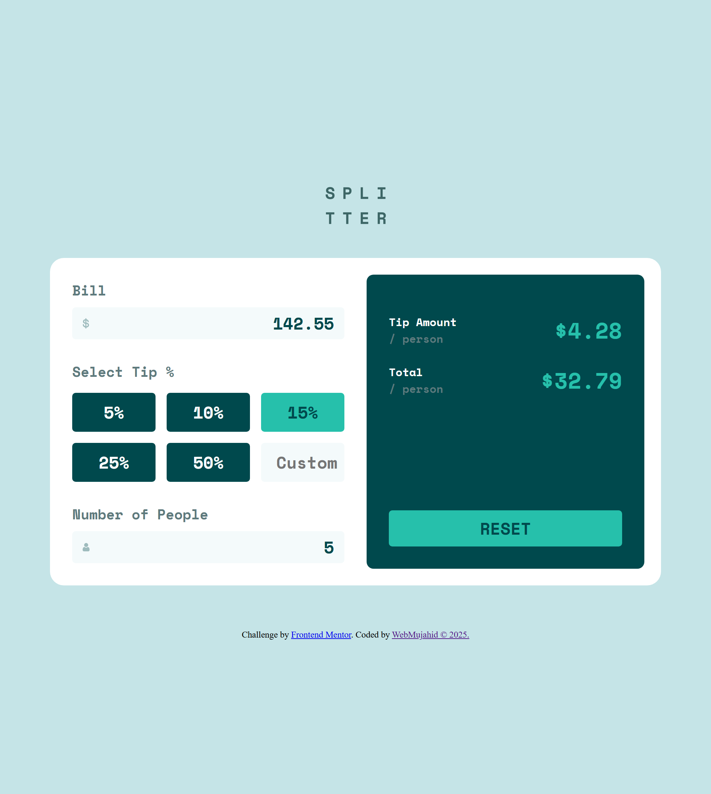
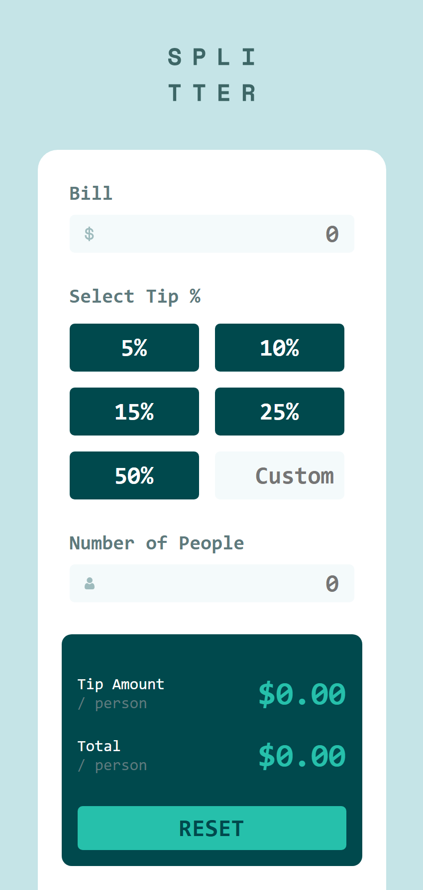

# Frontend Mentor - Tip calculator app solution

This is my solution to the [Tip calculator app challenge on Frontend Mentor](https://www.frontendmentor.io/challenges/tip-calculator-app-ugJNGbJUX). This project helped me practice handling user inputs, conditional validations, and responsive layout designs.

## Table of contents

- [Overview](#overview)
  - [The challenge](#the-challenge)
  - [Screenshot](#screenshot)
  - [Links](#links)
- [My process](#my-process)
  - [Built with](#built-with)
  - [What I learned](#what-i-learned)
  - [Continued development](#continued-development)
  - [Useful resources](#useful-resources)
- [Author](#author)

---

## Overview

### The challenge

Users should be able to:

- View the optimal layout for the app depending on their device's screen size
- See hover states for all interactive elements on the page
- Input the bill amount, tip percentage (via buttons or custom), and number of people
- Get the calculated tip amount and total amount per person
- See a red error message and input highlight when the number of people is 0

### Screenshot




### Links

- Solution URL: [Add solution URL here](https://your-solution-url.com)
- Live Site URL: [Add live site URL here](https://your-live-site-url.com)

---

## My process

### Built with

- Semantic HTML5
- SCSS (Sass)
- CSS Custom Properties
- Flexbox & Grid
- Vanilla JavaScript (DOM manipulation & validation)
- Mobile-first responsive layout

### What I learned

- How to handle real-time input updates with `addEventListener("input")`
- Creating reusable input handlers with callback setters
- Validating and highlighting fields dynamically (e.g. zero people warning)
- Using `:root` and SCSS variables for color and layout consistency

Example snippet:

```js
function validatePeopleInput() {
  if (numPeople <= 0 || isNaN(numPeople)) {
    errorMsg.style.display = "inline";
    peopleWrapper.classList.add("error");
    return false;
  } else {
    errorMsg.style.display = "none";
    peopleWrapper.classList.remove("error");
    return true;
  }
}
Continued development
In the future, I would like to:

Refactor parts of the JS to make them more modular

Add keyboard accessibility for button focus

Store and retrieve the last used values using localStorage

Convert this into a reusable React component

Useful resources
MDN Web Docs — Always helpful for native JS methods.

Frontend Mentor Community — For inspiration and guidance on similar solutions.

Author
Website – YourName

Frontend Mentor – @yourusername

Twitter – @yourusername
```
